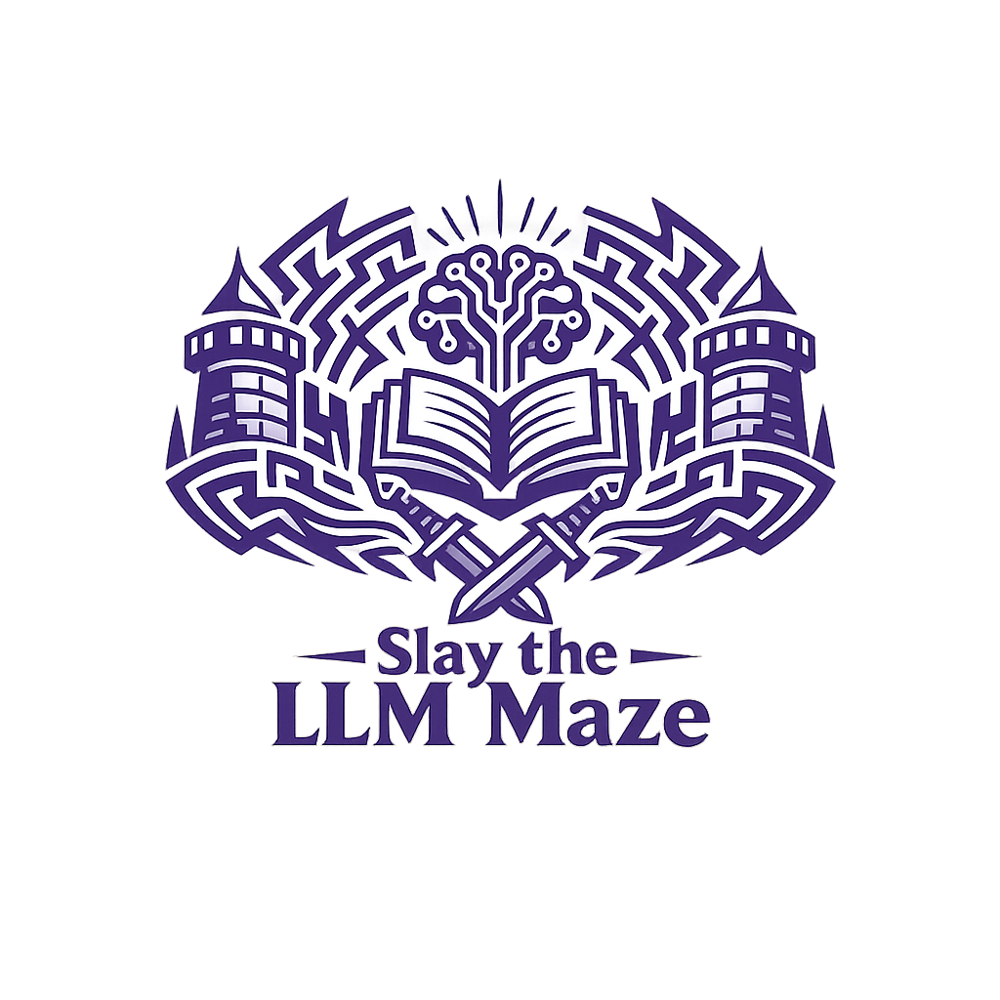
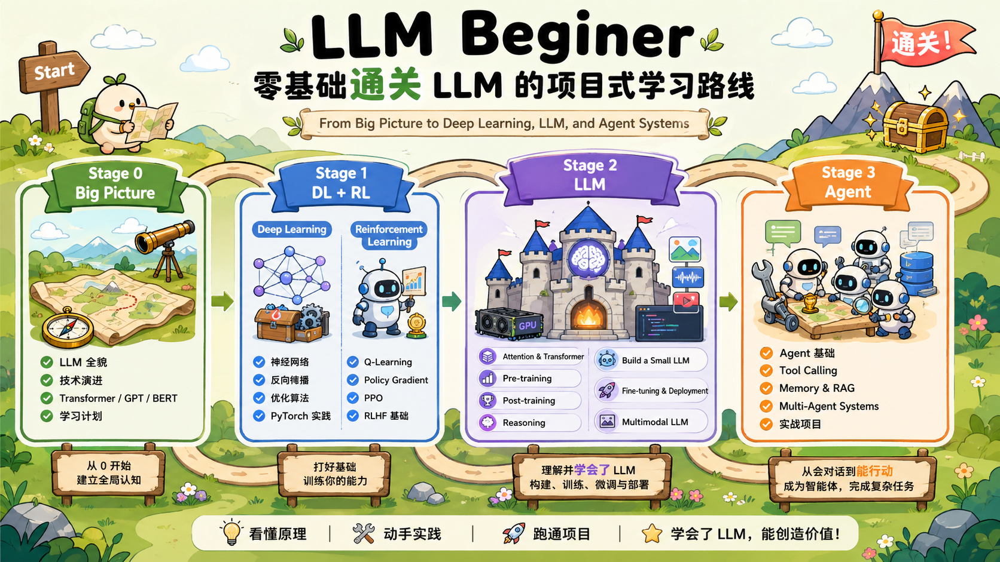
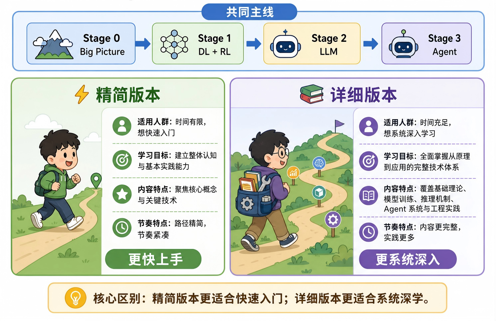

<div align="center">



# 零基础通关 LLM 的项目式学习路线
<p align="center">
  <a href="https://github.com/MLNLP-World/LLMBeginner/stargazers">
    
  </a>
  <a href="https://github.com/MLNLP-World/LLMBeginner/network/members">
    
  </a>
  <a href="https://github.com/MLNLP-World/LLMBeginner/issues">
    
  </a>
  
  
</p>

<p align="center">
  
  
  
</p>

> 该项目旨在为初学者提供一条清晰的大模型学习路径，从零基础出发，循序渐进地理解 LLM 的核心原理、训练机制与应用范式，并逐步过渡到智能体（Agent）的构建与基础实践。我们希望在“会用”的基础上，进一步帮助学习者实现“看懂、做出、跑通”。由于我们能力与经验有限，内容难免存在不足，欢迎交流与指正。😀 


</div>

<table>
  <tr>
    <td width="33%" valign="top">
      <h3>🧭 你能获得什么</h3>
      <p>从 Big Picture 到 DL / RL、LLM、Agent 的完整学习主线。</p>
    </td>
    <td width="33%" valign="top">
      <h3>🧱 这份路线怎么学</h3>
      <p>按阶段推进，每阶段都给出目标、资料与可落地的练习方向。</p>
    </td>
    <td width="33%" valign="top">
      <h3>🎯 适合谁</h3>
      <p>适合零基础入门且准备做 LLM或Agent 项目的人。</p>
    </td>
  </tr>
</table>

<!-- > 由于我们能力与经验有限，内容难免存在不足或疏漏，欢迎交流、补充与指正。😀  -->

</div>


<!-- <table>
  <tr>
    <td width="50%" valign="top">
      <h4>✨ 快速入口</h4>
      <p>
        <a href="#-路线总览">路线总览</a><br/>
        <a href="#-学习路径选择">学习路径选择</a><br/>
        <a href="#stage-0-big-picture">Stage 0</a><br/>
        <a href="#stage-1-dl--rl-基础">Stage 1</a>
      </p>
    </td>
    <td width="50%" valign="top">
      <h4>🛠️ 学习方式</h4>
      <p>看懂概念 → 精读资料 → 跑通代码 → 做小项目 → 构建自己的知识图谱</p>
    </td>
  </tr>
</table> -->


---

## 🔥 News

- **2026-04** - 项目启动，建立学习路线框架

## 📋 路线总览

本仓库采用阶段式学习路径（Staged Learning Path），旨在帮助你从零基础逐步成长为具备 LLM 研究能力的开发者。每个阶段都有明确的学习重点和核心目标。

<!-- <p>
  
  
  
  
</p> -->
<div align="center">

| 阶段 | 学习重点 | 核心目标 |
|:---:|:---:|:---|
| 🗺️ **Stage 0** | Big Picture | 理解整体路径与最终目标 |
| 📚 **Stage 1** | DL + RL | 建立深度学习与强化学习基础 |
| 🤖 **Stage 2** | LLM | 构建大语言模型并掌握后训练方法 |
| 🧩 **Stage 3** | Agent | 构建智能体框架与应用 |

</div>

<div align="center">
  
</div>

---
## 🚀 学习路径选择

针对不同程度的学习者，本项目建立了两个版本的学习路径供您选择：

<div align="center">
<table width="100%">
  <tr>
    <td width="5%" align="center">⚡</td>
    <td width="45%" valign="middle">
      <a href="#-精简版本"><b>精简版本</b></a><br/>
      <sub>快速跑通主线，尽快建立整体框架。</sub>
    </td>
    <td width="5%" align="center">📚</td>
    <td width="45%" valign="middle">
      <a href="#-详细版本"><b>详细版本</b></a><br/>
      <sub>系统打牢基础，补充更多代码实践。</sub>
    </td>
  </tr>
</table>
</div>

<br>

<div align="center">
  
</div>

---


<div style="background:#EAF4E2; color:#000000; border-left:5px solid #8BAF68; padding:12px 16px; border-radius:8px;">

### ⚡ 精简版本说明
- **适用人群**：时间有限、希望快速入门的学习者  
- **学习目标**：建立大模型的整体认知与基本实践能力  
- **内容特点**：聚焦核心概念与关键技术，路径精简、节奏紧凑

</div>

<details>
<summary><strong>查看精简版本内容</strong></summary>

<div style="margin-left: 1.5em;">

<details>
<summary><strong>🗺️ Stage 0: Big Picture</strong></summary>

在开始学习任何技术细节之前，先建立对整个 LLM 领域的全局认知至关重要。很多初学者容易陷入"学了很多，但不知道自己在哪里"的困境——Stage 0 就是为了避免这种迷失。

**本阶段目标：** 理解 LLM 的来龙去脉、主流技术路线、以及你自己的学习路径，产出一份个人学习计划。
<!-- > 补充材料：见 [stage0/supply.md](stage0/supply.md) -->

### 🧭 0.1 理解 LLM 的全貌

**① LLM 是什么？能做什么？**

在深入学习之前，先从宏观视角理解大语言模型：

- LLM 的核心能力来自海量数据上的预训练（Pre-training）
- 通过指令微调（Instruction Tuning）和人类反馈强化学习（RLHF）使模型变得"有用"
- 当前主流模型：GPT-4、Claude、Gemini、LLaMA、Qwen 等

**② LLM 的技术演进脉络**

理解历史脉络有助于理解为何现在的技术是这样的：

```
词向量时代（Word2Vec）
    → RNN / LSTM 序列模型
        → Transformer 架构（2017, Attention is All You Need）
            → BERT（理解型）/ GPT（生成型）
                → 大规模预训练（GPT-3, 175B 参数）
                    → 指令对齐（InstructGPT, RLHF）
                        → 当代 LLM（ChatGPT, Claude, Gemini...）
```

### 📖 0.2 推荐阅读

**李沐精读论文系列**

- 🔗 视频地址：https://space.bilibili.com/1567748478/lists?sid=32139
- 💡 推荐理由：逐行精读 Transformer、BERT、GPT 等奠基论文，帮助你建立"读论文"的能力，这是 LLM 研究者的核心技能。


### 🎯 0.3 制定你的个人学习计划

在完成上述内容后，请根据自身情况回答以下问题，写出你的学习计划：

| 问题 | 思考方向 |
|:---|:---|
| 我的目标是什么？ | 做应用开发 / 研究模型 / 理解原理 |
| 我的时间预算？ | 每周可投入多少小时 |
| 我的已有基础？ | Python 熟练度 / 数学基础（线代、概率） |
| 我计划跳过哪些内容？ | 结合目标裁剪路径，避免无效学习 |


> 💬 建议：把你的学习计划写成一个 Markdown 文件放在本地仓库的专用文件夹，定期回顾和更新。

</details>


<details>
<summary><strong>📚 Stage 1: DL + RL 基础</strong></summary>

<!-- > 补充材料：见 [stage1/supply.md](stage1/supply.md) -->

### 🟦 一、深度学习 (Deep Learning)

深度学习是理解 LLM 的基石。本部分帮助你掌握神经网络、反向传播、优化算法等核心概念，为后续学习 Transformer 架构打下坚实基础。

#### 🎬 1.1 视频课程

**吴恩达：深度学习专项课程**

- 🔗 课程链接：https://www.bilibili.com/video/BV1FT4y1E74V/
- 📒 配套笔记：https://github.com/MLNLP-World/Deep_Learning_Notes
- 💡 推荐理由：系统性强，适合建立完整的深度学习知识体系。


#### 💻 1.2 代码学习

**经典论文代码实现**

- 🔗 仓库地址：https://github.com/labmlai/annotated_deep_learning_paper_implementations
- ⭐ GitHub Stars: 66k+
- 💡 特点：论文逐行注释讲解，适合深入理解 Transformer、GPT 等模型实现细节


---

### 🟩 二、强化学习 (Reinforcement Learning)

强化学习是 LLM 后训练（RLHF）的核心技术。掌握 RL 基础将帮助你理解如何通过人类反馈优化模型行为。

#### 🎬 2.1 视频课程

**动画中学强化学习**

- 🔗 课程链接：https://space.bilibili.com/399855081/lists/4452634?type=series
- 📒 配套笔记：https://github.com/MLNLP-World/Reinforcement-Learning-Comic-Notes/
- 💡 推荐理由：以漫画形式讲解 RL 核心概念，零基础友好，大幅降低入门门槛。


#### 💻 2.2 代码学习

**Hands-on-RL（动手学强化学习）**

- 🔗 仓库地址：https://github.com/boyu-ai/Hands-on-RL
- 💡 推荐理由：配套教材《动手学强化学习》，从基础算法（Q-Learning）到 PPO 逐步实现，代码简洁，适合边学理论边写代码


---

</details>


<details>
<summary><strong>🤖 Stage 2: LLM</strong></summary>

完成 Stage 1 后，你已具备深度学习与强化学习的基础。Stage 2 的目标是真正理解 LLM 的内部机制，并亲手构建和训练一个语言模型。

**本阶段目标：** 掌握 Transformer 架构原理 → 理解预训练与后训练方法 → 掌握推理模型 → 从零实现小型 LLM → 在真实大模型上做微调实战 → 拓展到多模态。
<!-- > 补充材料：见 [stage2/supply.md](stage2/supply.md) -->

---

### 🔩 一、LLM 基础知识快览

在动手写代码之前，必须真正理解 Transformer 的每一个组件——注意力机制不是魔法，它是有数学直觉的。

#### 📖 1.1 核心论文精读

**Attention is All You Need**

- 🔗 论文地址：https://arxiv.org/abs/1706.03762
- 🔗 李沐精读视频：https://www.bilibili.com/video/BV1pu411o7BE
- 💡 重点理解：Multi-Head Self-Attention、位置编码（Positional Encoding）、Encoder-Decoder 结构


#### 🎬 1.2 视频讲解

**李宏毅：生成式 AI 时代下的机器学习（LLM 重点章节）**

- 🔗 课程地址：https://speech.ee.ntu.edu.tw/~hylee/ml/2026-spring.php
- 💡 推荐理由：中文讲解清晰，能够把 Transformer、预训练、对齐与生成式 AI 的整体脉络串起来，适合作为 Stage 2 的主线视频课。

---


### 🛠️ 二、动手实战：从零实现一个 LLM

理论学完，动手是关键。这一部分帮助你把前面所学串联起来，亲手训练一个完整的小型语言模型。


**① minimind**

- 🔗 仓库地址：https://github.com/jingyaogong/minimind ｜ https://github.com/jingyaogong/minimind-v     （多模态版本）
- ⭐ GitHub Stars: 20k+
- 💡 推荐理由：完整实现了预训练 → SFT → RLHF 全流程，代码注释详细，中文社区友好，适合跟着走完整个训练 pipeline。
- 📑 推荐学习顺序：
  * 在 minimind 上走完 预训练 → SFT → DPO 全流程
  * 尝试修改超参数（层数、头数、学习率），观察训练曲线变化

**② LLM-from-scratch （从零实现大模型功能拆解讲述）**

- 🔗 中文翻译版本仓库地址：https://github.com/MLNLP-World/LLMs-from-scratch-CN
- ⭐ GitHub Stars: 2k+
- 🔗 原仓库地址：https://github.com/rasbt/LLMs-from-scratch
- ⭐ GitHub Stars: 91k+
- 💡 推荐理由：不仅关注 LLMs 的基础构建，如 Transformer 架构、序列建模 等，还深入探索了 GPT、BERT 等深度学习模型 的底层实现。项目中的每一部分均配备详细的代码实现和学习资源，帮助学习者从零开始构建 LLMs，全面掌握其核心技术。

---

</details>


<details>
<summary><strong>🧩 Stage 3: Agent</strong></summary>

完成 Stage 2 后，你已掌握 LLM 的训练、推理与部署。Stage 3 关注如何把模型放进**闭环**：感知 → 决策 → 行动 → 观察 → 更新状态，直至任务完成。

**本阶段目标：** 从范式上区分“聊天模型”与“行动者”→ 掌握规划（任务分解、动态规划与反思）、记忆（短期/长期记忆管理）与工具调用的核心能力 → 理解多智能体的协议、组织与环境 → 跟跑至少一个开源项目，并自选垂直场景深入。
<!-- > 补充材料：见 [stage3/supply.md](stage3/supply.md) -->

---

### 🧭 一、理解 Agent：从 LLM 到行动者

**定义：** 智能体（Agent）被定义为一种能够感知环境、进行推理、自主决策并采取行动以实现特定目标的系统。

**与普通 Chatbot 的区别：**

| Chatbot | Agent |
|:---|:---|
| 被动响应用户输入 | 主动规划并执行任务 |
| 单轮或有限轮对话 | 多轮迭代直至目标达成 |
| 仅依赖内置知识 | 可调外部工具获取实时信息 |

**能力边界：**

✅ **能做到**：多步推理与规划、调用外部工具扩展能力、与环境/用户持续交互、利用长期记忆保持上下文。

❌ **做不到**：完全自主设定目标（仍需人类定义任务）、真正的理解与意识（仍是模式匹配）。

**李宏毅：一堂课搞懂 AI Agent 的原理**

- 🔗 视频地址：https://www.youtube.com/watch?v=M2Yg1kwPpts
- 💡 推荐理由：系统讲解 Agent 的核心概念，适合快速建立整体认知并入门。


### 🧪 二、实战项目

#### 🔍 DeepResearch Agent

**langchain-ai/open_deep_research**

- 🔗 仓库地址：https://github.com/langchain-ai/open_deep_research   
- ⭐ GitHub Stars: 11k+  
- 💡 推荐理由：适合作为全流程主线的多轮检索、压缩与成稿 pipeline，和 LangChain 生态、Provider/MCP 组合较好接；想一次性完成“子研究 → 综合 → 报告”的模块切分时优先选它。


#### 🖥️ GUI Agent

**UI-TARS**

- 🔗 仓库地址：https://github.com/bytedance/UI-TARS  
- ⭐ GitHub Stars: 10k+ 
- 💡 推荐理由：字节开源的原生 GUI 交互 / 多模态智能体，支持桌面与移动端，结合 VLM 视觉理解与精准动作预测。

#### 🌐 Computer Use Agent

**Browser Use**

- 🔗 仓库地址：https://github.com/browser-use/browser-use   
- ⭐ GitHub Stars: 90k+  
- 💡 推荐理由：社区热度较高浏览器自动化 Agent，能够控制真实浏览器，支持表单填写、购物等网页操作。

#### 🛍️ 基于 OpenClaw 部署小红书自动运营

**① OpenClaw**
- 🔗 仓库地址：https://github.com/openclaw/openclaw
- ⭐ GitHub Stars: 360k+（GitHub 史上最快破记录的开源项目）
- 💡 项目背景：由奥地利独立开发者 Peter Steinberger 于 2025 年 11 月发布，本地运行、全平台支持，通过 Skill 插件体系可扩展各类自动化能力，接入 Telegram / Feishu / WeChat 等 20+ 渠道，100 天内超过 Linux 和 React 成为 GitHub 最多 Star 的软件仓库。

**② xiaohongshu-ops-skill（OpenClaw 小红书运营插件）**
- 🔗 仓库地址：https://github.com/Xiangyu-CAS/xiaohongshu-ops-skill
- ⭐ GitHub Stars: 600+
- 💡 推荐理由：将 OpenClaw 变成小红书运营助手，支持"分析竞品 → 智能选题 → 生成文案 → 自动发布"全流程，基于浏览器自动化（CDP）真实账号操作，作者实测 20 天从 0 粉涨到 1000+ 粉，且未触发风控。
- 🛠️ 推荐实现路径：
  ```
  1. 安装 OpenClaw 本体，配置 LLM API Key
  2. 安装小红书 Skill：https://github.com/Xiangyu-CAS/xiaohongshu-ops-skill
  3. 扫码绑定小红书账号（仅需一次）
  4. 下达自然语言指令，Agent 自动完成热点抓取 → 文案创作 → 定时发布
  ```
- ⚠️ 注意：控制操作频率，避免短时大量发布触发平台风控。


</details>


</details>


---


<div style="background:#F3F0D7; color:#000000; border-left:5px solid #A3B18A; padding:12px 16px; border-radius:8px;">


### 📚 详细版本说明
- **适用人群**：有充足时间、希望系统深入学习的学习者  
- **学习目标**：全面掌握从原理到应用的完整技术体系  
- **内容特点**：覆盖基础理论、模型训练、推理机制、Agent 系统与工程实践等全流程内容  

</div>


<details>
<summary><strong>查看详细版本内容</strong></summary>


<div style="margin-left: 1.5em;">


<details>
<!-- ## 🗺️ Stage 0: Big Picture -->
<summary><strong>🗺️ Stage 0: Big Picture</strong></summary>


在开始学习任何技术细节之前，先建立对整个 LLM 领域的全局认知至关重要。很多初学者容易陷入"学了很多，但不知道自己在哪里"的困境——Stage 0 就是为了避免这种迷失。

**本阶段目标：** 理解 LLM 的来龙去脉、主流技术路线、以及你自己的学习路径，产出一份个人学习计划。

### 🧭 0.1 理解 LLM 的全貌

**① LLM 是什么？能做什么？**

在深入学习之前，先从宏观视角理解大语言模型：

- LLM 的核心能力来自海量数据上的预训练（Pre-training）
- 通过指令微调（Instruction Tuning）和人类反馈强化学习（RLHF）使模型变得"有用"
- 当前主流模型：GPT-4、Claude、Gemini、LLaMA、Qwen 等

**② LLM 的技术演进脉络**

理解历史脉络有助于理解为何现在的技术是这样的：

```
词向量时代（Word2Vec）
    → RNN / LSTM 序列模型
        → Transformer 架构（2017, Attention is All You Need）
            → BERT（理解型）/ GPT（生成型）
                → 大规模预训练（GPT-3, 175B 参数）
                    → 指令对齐（InstructGPT, RLHF）
                        → 当代 LLM（ChatGPT, Claude, Gemini...）
```

### 📖 0.2 推荐阅读

**① 李沐精读论文系列（必看）**

- 🔗 视频地址：https://space.bilibili.com/1567748478/lists?sid=32139
- 💡 推荐理由：逐行精读 Transformer、BERT、GPT 等奠基论文，帮助你建立"读论文"的能力，这是 LLM 研究者的核心技能。

**② Andrej Karpathy：Neural Networks: Zero to Hero**

- 🔗 视频地址：https://www.youtube.com/playlist?list=PLAqhIrjkxbuWI23v9cThsA9GvCAUhRvKZ
- 💡 推荐理由：从最基础的神经网络一路讲到 GPT，是目前最好的 LLM 入门叙事线，强烈建议作为 Stage 0 的压轴内容。

### 🎯 0.3 制定你的个人学习计划

在完成上述内容后，请根据自身情况回答以下问题，写出你的学习计划：

| 问题 | 思考方向 |
|:---|:---|
| 我的目标是什么？ | 做应用开发 / 研究模型 / 理解原理 |
| 我的时间预算？ | 每周可投入多少小时 |
| 我的已有基础？ | Python 熟练度 / 数学基础（线代、概率） |
| 我计划跳过哪些内容？ | 结合目标裁剪路径，避免无效学习 |


> 💬 建议：把你的学习计划写成一个 Markdown 文件放在本地仓库的专用文件夹，定期回顾和更新。

</details>


<details>
<!-- ## 📚 Stage 1: DL + RL 基础 -->

<summary><strong>📚 Stage 1: DL + RL 基础</strong></summary>


### 🟦 一、深度学习 (Deep Learning)

深度学习是理解 LLM 的基石。本部分帮助你掌握神经网络、反向传播、优化算法等核心概念，为后续学习 Transformer 架构打下坚实基础。

#### 🎬 1.1 视频课程

**① 吴恩达：深度学习专项课程**

- 🔗 课程链接：https://www.bilibili.com/video/BV1FT4y1E74V/
- 📒 配套笔记：https://github.com/MLNLP-World/Deep_Learning_Notes
- 💡 推荐理由：系统性强，适合建立完整的深度学习知识体系。

**② 李沐：动手学深度学习**

- 🔗 课程链接：https://space.bilibili.com/1567748478/lists?sid=358497
- 📒 配套笔记：https://github.com/MLNLP-World/Deep_Learning_Notes
- 💡 推荐理由：理论与代码结合紧密，注重动手实践。

#### 💻 1.2 代码学习

**① 经典论文代码实现（强烈推荐）**

- 🔗 仓库地址：https://github.com/labmlai/annotated_deep_learning_paper_implementations
- ⭐ GitHub Stars: 66k+
- 💡 特点：论文逐行注释讲解，适合深入理解 Transformer、GPT 等模型实现细节

**② 可视化学习网站**

- 🔗 网站地址：https://nn.labml.ai/
- 💡 推荐理由：代码与解释同步展示，交互式体验，非常适合初学者直观理解模型结构。

---

### 🟩 二、强化学习 (Reinforcement Learning)

强化学习是 LLM 后训练（RLHF）的核心技术。掌握 RL 基础将帮助你理解如何通过人类反馈优化模型行为。

#### 🎬 2.1 视频课程

**① 动画中学强化学习（最容易理解）**

- 🔗 课程链接：https://space.bilibili.com/399855081/lists/4452634?type=series
- 📒 配套笔记：https://github.com/MLNLP-World/Reinforcement-Learning-Comic-Notes/
- 💡 推荐理由：以漫画形式讲解 RL 核心概念，零基础友好，大幅降低入门门槛。

**② 李宏毅：强化学习课程**

- 🔗 课程链接：https://www.bilibili.com/video/BV1XP4y1d7Bk
- 💡 推荐理由：中文讲解清晰，善用直观类比，适合快速建立 RL 整体认知。

**③ 王树森：深度强化学习（DRL）**

- 🔗 课程链接：https://www.bilibili.com/video/BV12o4y197US
- 💡 推荐理由：史蒂文斯理工学院王树森博士主讲，语言简洁有力，抛弃繁琐的数学推导，直接给出直观易懂的结论，初学者能在短时间内快速建立 DRL 整体体系认知。

#### 💻 2.2 代码学习

**① Hands-on-RL（动手学强化学习）**

- 🔗 仓库地址：https://github.com/boyu-ai/Hands-on-RL
- 💡 推荐理由：配套教材《动手学强化学习》，从基础算法（Q-Learning）到 PPO 逐步实现，代码简洁，适合边学理论边写代码

**② easy-rl（强化学习中文教程）**

- 🔗 仓库地址：https://github.com/datawhalechina/easy-rl
- 💡 推荐理由：Datawhale 出品，中文注释详细，覆盖主流 RL 算法实现，社区活跃，适合中文学习者系统入门。

---

</details>


<details>
<!-- ## 🤖 Stage 2: LLM -->
<summary><strong>🤖 Stage 2: LLM</strong></summary>


完成 Stage 1 后，你已具备深度学习与强化学习的基础。Stage 2 的目标是真正理解 LLM 的内部机制，并亲手构建和训练一个语言模型。

**本阶段目标：** 掌握 Transformer 架构原理 → 理解预训练与后训练方法 → 掌握推理模型 → 从零实现小型 LLM → 在真实大模型上做微调实战 → 拓展到多模态。

---

### 🔩 一、机制理解：Attention & Transformer

在动手写代码之前，必须真正理解 Transformer 的每一个组件——注意力机制不是魔法，它是有数学直觉的。

#### 📖 1.1 核心论文精读

**① Attention is All You Need（2017，必读）**

- 🔗 论文地址：https://arxiv.org/abs/1706.03762
- 🔗 李沐精读视频：https://www.bilibili.com/video/BV1pu411o7BE
- 💡 重点理解：Multi-Head Self-Attention、位置编码（Positional Encoding）、Encoder-Decoder 结构

**② The Illustrated Transformer（最直观的图解）**

- 🔗 文章地址：https://jalammar.github.io/illustrated-transformer/
- 💡 推荐理由：全程配图讲解 Attention 的计算过程，是理解 Transformer 最友好的入门材料，建议与论文配合阅读。

#### 🎬 1.2 视频讲解

**李宏毅：生成式 AI 时代下的机器学习（LLM 重点章节）**

- 🔗 课程地址：https://speech.ee.ntu.edu.tw/~hylee/ml/2026-spring.php
- 💡 推荐理由：中文讲解清晰，能够把 Transformer、预训练、对齐与生成式 AI 的整体脉络串起来，适合作为 Stage 2 的主线视频课。

**Andrej Karpathy：Let's build GPT from scratch**

- 🔗 视频地址：https://www.youtube.com/watch?v=kCc8FmEb1nY
- 🔗 配套代码：https://github.com/karpathy/nanoGPT
- 💡 推荐理由：2 小时内从零手写一个 GPT，边写边讲原理，是目前最好的 Transformer 实践教程。

---

### 🏋️ 二、预训练（Pre-training）

预训练是 LLM 能力的来源。理解预训练的目标函数、数据处理和训练技巧，是研究 LLM 的必要基础。

**核心概念：**

- **Next Token Prediction**：自回归语言模型的训练目标，模型通过预测下一个词来学习语言规律
- **Scaling Law**：模型参数量、数据量、计算量三者的幂律关系，指导如何高效扩大模型规模
- **训练技巧**：混合精度训练（FP16/BF16）、梯度累积、学习率调度（Warmup + Cosine Decay）

**① Scaling Laws for Neural Language Models（必读论文）**

- 🔗 论文地址：https://arxiv.org/abs/2001.08361
- 💡 重点理解：为什么更大的模型 + 更多数据 = 更好的效果，以及如何用有限算力做出最优决策

**② LLaMA 技术报告（工程实践参考）**

- 🔗 论文地址：https://arxiv.org/abs/2302.13971
- 💡 推荐理由：Meta 开源模型的技术细节，展示了完整的预训练工程实践，包括数据配比、训练稳定性等问题的解决方案。

---

### 🎯 三、后训练（Post-training）

预训练后的模型只会"续写文本"，后训练让模型变得"听话"且"有用"。这是当前 LLM 研究最活跃的方向之一。

**后训练技术路线：**

```
预训练模型（Base Model）
    → SFT 监督微调：用高质量对话数据教模型"怎么回答"
        → RM 奖励模型训练：学习人类对回答质量的偏好
            → RLHF / PPO：用 RL 让模型最大化奖励，对齐人类期望
                → DPO：更简洁的对齐方案，无需显式 RM
```

**① InstructGPT 论文（RLHF 的奠基之作）**

- 🔗 论文地址：https://arxiv.org/abs/2203.02155
- 🔗 李沐精读视频：https://www.bilibili.com/video/BV1hd4y187CR
- 💡 重点理解：三阶段训练流程（SFT → RM → PPO），以及为什么 RLHF 能显著提升模型有用性

**② DPO 论文（更简洁的对齐方法）**

- 🔗 论文地址：https://arxiv.org/abs/2305.18290
- 💡 推荐理由：绕过奖励模型，直接从偏好数据优化策略，是目前工业界最常用的对齐方案之一


---

### 🧠 四、推理（Reasoning）

传统 LLM 是"快思考"模型，直接输出答案。推理模型引入"慢思考"机制，通过显式的推理过程（如思维链、自我反思）来提升复杂问题的求解能力。

#### 4.1 System 2 Thinking（慢思考 / 推理模型）

**核心思想：** 让模型在回答前先"思考"——生成中间推理步骤，而不是直接给出答案。这类似人类的 System 2 思维（深思熟虑），而非 System 1（直觉反应）。

**代表模型：**

- **OpenAI o1 系列**：通过强化学习训练模型生成长推理链，在数学、编程等任务上显著超越 GPT-4
- **DeepSeek-R1**：开源的推理模型，公开了训练方法和推理过程，是目前最具影响力的开源推理模型

**① DeepSeek-R1 技术报告（必读）**

- 🔗 论文地址：https://arxiv.org/abs/2501.12948
- 💡 重点理解：如何用 RL 训练模型生成高质量推理链，以及推理模型与传统 LLM 的训练差异

**② Chain-of-Thought Prompting（思维链提示）**

- 🔗 论文地址：https://arxiv.org/abs/2201.11903
- 💡 推荐理由：推理模型的理论基础，展示了"让模型一步步思考"如何显著提升复杂推理任务的表现。

**③ 代码实践：OpenR（开源推理模型训练框架）**

- 🔗 仓库地址：https://github.com/openreasoner/openr
- ⭐ GitHub Stars: 3k+
- 💡 推荐理由：提供完整的推理模型训练 pipeline，包括推理数据生成、RL 训练等，是动手实践推理模型的最佳起点。

---

### 🛠️ 五、轻量小项目：从零实现一个 LLM

理论学完，动手是关键。这一部分帮助你把前面所学串联起来，亲手训练一个完整的小型语言模型。

**① nanoGPT（最推荐的起点）**

- 🔗 仓库地址：https://github.com/karpathy/nanoGPT
- ⭐ GitHub Stars: 40k+
- 💡 推荐理由：Karpathy 出品，约 300 行核心代码实现完整 GPT 训练，可在单张 GPU 上跑通，是从零实现 LLM 的最佳模板。

**② minimind（中文小模型全流程实现）**

- 🔗 仓库地址：https://github.com/jingyaogong/minimind ｜ https://github.com/jingyaogong/minimind-v （多模态版本）
- ⭐ GitHub Stars: 20k+
- 💡 推荐理由：完整实现了预训练 → SFT → RLHF 全流程，代码注释详细，中文社区友好，适合跟着走完整个训练 pipeline。

**③ LLM-from-scratch （从零实现大模型功能拆解讲述）**

- 🔗 中文翻译版本仓库地址：https://github.com/MLNLP-World/LLMs-from-scratch-CN
- ⭐ GitHub Stars: 2k+
- 🔗 原仓库地址：https://github.com/rasbt/LLMs-from-scratch
- ⭐ GitHub Stars: 91k+
- 💡 推荐理由：不仅关注 LLMs 的基础构建，如 Transformer 架构、序列建模 等，还深入探索了 GPT、BERT 等深度学习模型 的底层实现。项目中的每一部分均配备详细的代码实现和学习资源，帮助学习者从零开始构建 LLMs，全面掌握其核心技术。

**推荐学习顺序：**

1. 跑通 nanoGPT，理解训练循环的每一行代码
2. 在 minimind 上走完 预训练 → SFT → DPO 全流程
3. 尝试修改超参数（层数、头数、学习率），观察训练曲线变化

---

### 🚀 六、大模型实战：微调与部署

在真实大模型上做实验，是从"理解原理"到"工程落地"的关键一步。

#### 6.1 高效微调（PEFT）

全量微调大模型成本极高，PEFT 方法只训练少量参数，即可达到接近全量微调的效果。

**① LoRA（最主流的高效微调方法）**

- 🔗 论文地址：https://arxiv.org/abs/2106.09685
- 💡 核心思想：将权重更新分解为两个低秩矩阵的乘积，只训练约 0.1% 的参数量即可达到不错效果

**② LLaMA-Factory（一站式微调框架）**

- 🔗 仓库地址：https://github.com/hiyouga/LLaMA-Factory
- ⭐ GitHub Stars: 40k+
- 💡 推荐理由：支持主流开源模型（LLaMA、Qwen、Mistral 等）的 SFT / DPO / LoRA 微调，提供 WebUI，降低工程门槛。


**③ veRL（大规模 RLHF 训练框架）**

- 🔗 仓库地址：https://github.com/volcengine/verl
- ⭐ GitHub Stars: 8k+
- 💡 推荐理由：字节跳动开源的分布式 RLHF 训练框架，支持 PPO / GRPO 等算法，与 HuggingFace 生态无缝集成，是目前在真实大模型上做 RLHF 实验的最佳选择之一

#### 6.2 推理与部署

**① Ollama（本地运行大模型最简单的方式）**

- 🔗 官网地址：https://ollama.com/
- 💡 推荐理由：一行命令在本地运行 LLaMA、Qwen 等模型，适合快速体验和调试。

**② vLLM（高性能推理框架）**

- 🔗 仓库地址：https://github.com/vllm-project/vllm
- ⭐ GitHub Stars: 45k+
- 💡 推荐理由：基于 PagedAttention 技术，大幅提升推理吞吐量，是目前生产环境部署 LLM 的主流选择。

---

### 🖼️ 七、多模态 LLM（Multimodal LLM）

纯文本 LLM 之外，多模态模型能够同时理解图像、视频、音频等信息。这是当前前沿研究和产品落地最活跃的方向之一。

**多模态的核心问题：** 如何把不同模态的信息"对齐"到同一个语义空间，让语言模型能够理解图像？

**模态融合的主流架构：**

```
图像编码器（Vision Encoder，如 ViT / CLIP）
    → 将图像切成 Patch，编码为向量序列
        → 投影层（Projector）：把视觉 token 映射到语言模型的词向量空间
            → 语言模型（LLM）：统一处理文字 + 图像 token，生成回答
```

#### 📖 7.1 核心论文

**① CLIP（视觉-语言对齐的奠基之作）**

- 🔗 论文地址：https://arxiv.org/abs/2103.00020
- 💡 重点理解：对比学习如何让图像和文本在同一空间对齐，这是多模态模型的底层基础

**② LLaVA（最具影响力的开源多模态模型）**

- 🔗 论文地址：https://arxiv.org/abs/2304.08485
- 🔗 李沐精读视频：https://www.bilibili.com/video/BV1iN411r7ma
- 💡 推荐理由：结构简洁（CLIP + Projector + LLaMA），用指令微调实现视觉问答，是理解多模态 LLM 架构的最佳入门论文。

**③ Qwen-VL 技术报告（工程实践参考）**

- 🔗 论文地址：https://arxiv.org/abs/2308.12966
- 💡 推荐理由：详细描述了一个完整的多模态模型训练流程，包括多阶段训练策略和数据配比，适合工程落地参考。

#### 💻 7.2 代码实践

**LLaVA 官方仓库**

- 🔗 仓库地址：https://github.com/haotian-liu/LLaVA
- ⭐ GitHub Stars: 22k+
- 💡 推荐理由：代码结构清晰，支持自定义数据集微调，是动手实践多模态模型的最佳起点。

---

<!-- ## 🧩 Stage 3: Agent -->

</details>


<details>

<summary><strong>🧩 Stage 3: Agent</strong></summary>

完成 Stage 2 后，你已掌握 LLM 的训练、推理与部署。Stage 3 关注如何把模型放进**闭环**：感知 → 决策 → 行动 → 观察 → 更新状态，直至任务完成。

**本阶段目标：** 从范式上区分“聊天模型”与“行动者”→ 掌握规划（任务分解、动态规划与反思）、记忆（短期/长期记忆管理）与工具调用的核心能力 → 理解多智能体的协议、组织与环境 → 跟跑至少一个开源项目，并自选垂直场景深入。

---

### 🧭 一、理解 Agent：从 LLM 到行动者

#### 📋 1.1 Agent 的核心定义与能力边界

**定义：** 智能体（Agent）被定义为一种能够感知环境、进行推理、自主决策并采取行动以实现特定目标的系统。

**与普通 Chatbot 的区别：**

| Chatbot | Agent |
|:---|:---|
| 被动响应用户输入 | 主动规划并执行任务 |
| 单轮或有限轮对话 | 多轮迭代直至目标达成 |
| 仅依赖内置知识 | 可调外部工具获取实时信息 |

**能力边界：**

✅ **能做到**：多步推理与规划、调用外部工具扩展能力、与环境/用户持续交互、利用长期记忆保持上下文。

❌ **做不到**：完全自主设定目标（仍需人类定义任务）、真正的理解与意识（仍是模式匹配）。

**① 李宏毅：一堂课搞懂 AI Agent 的原理**

- 🔗 视频地址：https://www.youtube.com/watch?v=M2Yg1kwPpts
- 💡 推荐理由：系统讲解 Agent 的核心概念，适合快速建立整体认知并入门。

**② 吴恩达：Agentic AI**

- 🔗 视频地址：https://learn.deeplearning.ai/courses/agentic-ai/
- 💡 推荐理由：从 Agentic Workflow 基础概念到 Reflection、Tool Use、多 Agent 协作等设计模式，是系统学习 Agent 工程实践的入门课程。

**③ Lilian Weng：LLM Powered Autonomous Agents**

- 🔗 博文地址：https://lilianweng.github.io/posts/2023-06-23-agent/
- 💡 推荐理由：全面解析 LLM Agent 的设计范式与关键技术，配有丰富的案例分析，是理解 LLM Agent 架构设计的优质参考。

**④ Agent 领域综述**

- 🔗 论文地址：https://arxiv.org/pdf/2309.07864
- 💡 推荐理由：长文综述类材料，可按目录选读，用于扩展视野。

---

### ⚙️ 二、Agent 核心能力

Agent 的本质是“系统”而非“模型”，LLM 提供推理能力，而系统架构决定 Agent 能否从“对话”走向“行动”。这涉及三个核心能力——规划、记忆和工具调用。

**规划 (Planning)**：决定任务如何分解、执行顺序如何安排、遇到错误如何调整。包括任务拆解（将复杂目标拆分为可执行的子任务链）、动态规划（ReAct 模式的推理-行动-观察循环）和自我反思（从失败中学习并优化策略）。

**记忆 (Memory)**：管理信息的存储与检索。短期记忆利用上下文窗口记录当前对话状态；长期记忆通过向量数据库存储历史经验或专业知识，随取随用。

**工具调用 (Tool Use)**：让 Agent 能操作外部环境。通过 API 调用搜索引擎、运行代码、访问数据库等，需要约定清晰的接口规范、权限控制和错误处理机制。

#### 🎯 2.1 规划

规划（Planning）是 Agent 的"大脑"，决定任务如何分解、执行顺序如何安排、遇到错误如何调整。好的规划能力让 Agent 从单次响应走向多步迭代，从被动执行走向主动优化。

**任务分解：**

将复杂目标拆分为可管理的子任务链。例如“帮我写一篇行业分析报告”可分解为：确定主题→搜集资料→整理大纲→撰写各章节→审核修改。每个子任务有明确的输入、输出和验收标准，便于 Agent 逐一执行和检查进度。

**动态规划与反思：**

- **ReAct 模式**：推理（Reasoning）→ 行动（Action）→ 观察（Observation）→ 再推理的循环。Agent 在每一步行动前先思考"我需要做什么"，执行后观察结果，再决定下一步。这种"思考-行动-反馈"的闭环让 Agent 能根据环境反馈调整策略。

- **自我反思（Self-Reflection）**：当行动结果不达标或出现错误时，Agent 能分析失败原因、总结教训并调整后续计划。Reflexion 等框架通过将失败经验存入记忆，让 Agent 在类似场景下避免重复犯错。

**推荐阅读：**

**① ReAct**

- 🔗 论文地址：https://arxiv.org/pdf/2210.03629
- 💡 重点理解：核心在于将思维链与动作交替结合，形成“思考-行动-观察”的闭环。模型在每一步行动前先写出推理过程，这不仅提高了决策的透明度，还允许模型根据环境的实时观察动态修正后续的推理。

**② Plan-and-Solve Prompting**

- 🔗 论文地址：https://arxiv.org/pdf/2305.04091 
- 💡 重点理解：提出了“先全局规划，后分步执行”的策略。模型首先将复杂任务拆解为子任务列表，然后再逐一解决，显著提升了处理多步骤逻辑问题的稳定性与准确率。

**③ Reflexion**

- 🔗 论文地址：https://arxiv.org/pdf/2303.11366   
- 💡 重点理解：引入了自我反思机制，通过在外部环境中试错来获取语言反馈。模型将失败的尝试存储在短期记忆中，并在下一次迭代时根据这些“教训”修正策略，这种“自省”能力让 Agent 具备了在不更新参数的情况下进行自我优化的能力。

#### 🧠 2.2 记忆

本节探讨 Agent 如何管理信息的存储与流动：短期（工作）记忆关注在有限上下文窗口内如何保留关键信息，长期记忆解决跨会话的知识持久化与检索，RAG 则负责将外部知识库实时接入推理过程。

**短期（工作）记忆：**

上下文窗口有限，只能保留最近的对话。常用策略：
- **滑动窗口**：仅保留最近 k 轮或固定长度 Token。实现最简单，但超出窗口的早期信息会彻底丢失。
- **摘要压缩**：周期性将历史压缩为摘要再继续。多次压缩可能导致细节失真。

**长期记忆：**

- 语义检索 + 重排序：将文档等知识转为向量存入数据库，检索时先用语义相似度召回候选片段，再用重排序模型精选最相关的内容。解决“如何从海量知识中找到当前问题真正需要的片段”。
- 结构化存储：将用户画像、任务状态、会话上下文等以结构化形式（如 JSON、数据库记录）持久化存储，随需读取。解决“跨会话记住用户偏好和应用状态”。 

**RAG 技术（检索增强生成）：**

- 推理时实时从外部知识库（文档、网页、数据库等）检索最相关的片段，再交给模型生成答案。这样模型既能利用实时/私有知识，又不受训练数据截止日期限制。

**推荐阅读：**

**① MemGPT**

- 🔗 论文地址：https://arxiv.org/abs/2310.08560
- 🔗 仓库地址：https://github.com/cpacker/MemGPT
- 💡 推荐理由：将 LLM 视为操作系统，通过虚拟上下文管理和分层存储实现“无限记忆”，是理解记忆层架构设计的奠基性工作。

**② Anthropic：Effective Context Engineering for AI Agents**

- 🔗 文档地址：https://www.anthropic.com/engineering/effective-context-engineering-for-ai-agents
- 💡 推荐理由：讲解如何有效地收集和管理上下文信息，最大化 Agent 的推理效率与输出质量。

**③ Claude-Mem**

- 🔗 文档地址：https://docs.claude-mem.ai/introduction
- 🔗 仓库地址：https://github.com/thedotmack/claude-mem
- 💡 推荐理由：工程向的长期记忆/持久化参考，适合自建部署时阅读。

**④ Mem0**

- 🔗 仓库地址：https://github.com/mem0ai/mem0
- ⭐ GitHub Stars: 54k+
- 🔗 论文地址：https://arxiv.org/pdf/2504.19413
- 🔗 博客地址：https://get.mem.ai/blog
- 💡 推荐理由：为LLM提供的智能的，可自我改进的记忆层，可以实现在各种应用中提供更加个性化的和连贯一致的用户体验，是较常用的记忆层实现参考之一。


**⑤ Agent Memory 综述（长文 PDF，选读）**

- 🔗 论文地址：https://arxiv.org/pdf/2512.13564
- 💡 推荐理由：可作为 agent memory 研究进展的补充阅读。


**⑥ LangChain 文档：RAG**

- 🔗 文档地址：https://docs.langchain.com/oss/python/langchain/rag
- 💡 推荐理由：官方文档里从加载、切分、向量库到检索接模型的主线，适合动手搭第一条 RAG 链路。

#### 🔧 2.3 工具调用

**工具是什么：把外部能力封装成可调用的函数**

工具是 Agent 的“手脚”：搜索、计算器、访问数据库、发消息等。除了名字和说明要清楚，还要约定入参/出参、超时、重试、是否改数据、给多大权限。

**工具设计原则：**

- **命名清晰**：函数名和参数名要直观表达功能，如 `search_weather` 优于 `func_01`；
- **描述详尽**：在函数描述中说明用途、返回值格式、可能的错误情况；
- **参数精简**：只暴露必要的参数，过多参数会增加模型理解负担；
- **错误处理**：定义清晰的错误码和回退策略，让 Agent 知道如何重试或报告。

**常见工具类型：**

| 类型 | 示例 | 用途 |
|:---|:---|:---|
| 信息获取 | 搜索引擎、天气查询、数据库查询 | 补充模型知识盲点 |
| 操作执行 | 发送邮件、创建日程、文件操作 | 与外部系统交互 |
| 计算处理 | 计算器、代码执行器、数据分析 | 处理精确计算任务 |
| 决策辅助 | 风险评估、合规检查、评分系统 | 提供结构化判断 |

**工具 vs 技能（Tool vs Skill）：**

- 工具（Tool）：底层原子能力，通常对应单个函数、API 或能力接口（如查询天气、获取时间、搜索知识点）。
- 技能（Skill）：业务层封装的复合能力模块，由一个或多个工具按业务逻辑组合而成，面向真实场景提供完整解决方案（如旅行规划 = 查天气 + 查航班 + 查酒店 + 生成路线）。

在实际项目中，Skill 往往对应一个可复用的能力模块，通过组合不同 Tool 实现完整场景闭环。

**推荐阅读：**

**① OpenAI：Function Calling 指南**

- 🔗 文档地址：https://platform.openai.com/docs/guides/function-calling
- 💡 推荐理由：结构化调用的行业常用约定，对应自然语言如何变成 JSON 参数、运行时如何执行与回写的闭环。

**② Anthropic：Tool Use 概览**

- 🔗 文档地址：https://docs.anthropic.com/claude/docs/tool-use
- 💡 推荐理由：介绍 Client/Server 工具的执行模式、Agent 循环的工作机制，以及工具调用的流程，适合理解工具集成的核心概念与实现路径。

**③ Model Context Protocol（MCP）**

- 🔗 文档地址：https://modelcontextprotocol.io/introduction
- 🔗 参考实现：https://github.com/modelcontextprotocol/servers
- 💡 推荐理由：提供标准化的工具与数据暴露方式，支持多种客户端复用同一套 MCP 服务。

**④ Agent Skills with Anthropic**

- 🔗 视频地址：https://learn.deeplearning.ai/courses/agent-skills-with-anthropic/information
- 💡 推荐理由：学习用开放标准构建可复用的智能体技能，掌握将技能、MCP 与子智能体组合的方法，搭建能访问外部数据、具备专业知识的强大的智能体系统。

---

### 🤝 三、多智能体系统


多智能体系统（Multi-Agent System，MAS）是指由多个具有自主决策能力的 AI Agent 协同完成复杂任务的系统。多 Agent 的核心优势在于任务分解、角色专业化与并行执行。


#### 🎯 3.1 什么是多智能体系统：任务驱动协作、自治群体交互

**核心思想**： 将一个复杂任务拆解给多个具有不同角色或能力的 Agent，让它们通过协作共同完成目标——类似于一个软件开发团队，产品经理、程序员、测试员各司其职。

**两种典型范式：**

| 范式 | 说明 | 代表系统 |
| :--- | :--- | :--- |
| **任务驱动协作** | 由明确目标驱动，Agent 分工完成子任务，最终汇总结果 | ChatDev、AutoGen |
| **自治群体交互** | Agent 在共享环境中自由交互，涌现出复杂的社会行为 | 斯坦福小镇 (Generative Agents) |

**推荐课程：**

**① 吴恩达：多智能体系统入门介绍**

- 🔗 课程地址：https://learn.deeplearning.ai/courses/agentic-ai/lesson/jcl177/planning-workflows
- 💡 推荐理由：介绍多 Agent 的核心概念与应用场景。
  
**② HuggingFace Agents Course（系统入门首选）**

- 🔗 课程地址：https://huggingface.co/learn/agents-course/
- 💡 推荐理由：HuggingFace 官方出品，从单 Agent 基础到多 Agent 协作循序渐进，配有可直接运行的代码实践，是目前最完整的开源 Agent 入门课程。

**代表系统精读：**

**① ChatDev（任务驱动的软件开发多智能体）**

- 🔗 论文地址：https://arxiv.org/abs/2307.07924
- 🔗 仓库地址：https://github.com/OpenBMB/ChatDev
- ⭐ GitHub Stars: 32k+
- 💡 重点理解：将软件开发流程（需求分析 → 设计 → 编码 → 测试）映射为多 Agent 角色分工，每个阶段由不同”职能” Agent 负责，Agent 间通过对话完成交接

**② Generative Agents：斯坦福小镇（自治群体交互）**

- 🔗 论文地址：https://arxiv.org/abs/2304.03442
- 💡 重点理解：25 个 Agent 在模拟小镇中自主生活、社交、形成记忆，展示了 LLM 驱动的群体涌现行为。核心机制：记忆流（Memory Stream）+ 反思（Reflection）+ 行动规划（Planning）


**延伸阅读：**

**① A Survey on LLM-based Autonomous Agents（全景综述）**

- 🔗 论文地址：https://arxiv.org/abs/2308.11432
- 💡 推荐理由：全面梳理 LLM Agent 的记忆、规划、工具使用与多 Agent 协作四大模块，适合在深入某个方向前建立完整的认知框架。

**② Large Language Model based Multi-Agents: A Survey of Progress and Challenges（多智能体专项综述）**

- 🔗 论文地址：https://arxiv.org/abs/2402.01680
- 💡 推荐理由：专注于多 Agent 系统本身，系统梳理 LLM 驱动的多 Agent 在通信、组织、环境与应用上的最新进展与挑战。

#### 📡 3.2 智能体之间如何「说话」？——交互协议

多 Agent 协作的基础是通信。不同系统对 Agent 间的消息格式、通信方式有不同设计。

**① 自然语言消息（最常见）**

- Agent 直接用自然语言对话，灵活但容易产生歧义
- 代表框架：AutoGen、ChatDev

**② 结构化消息（更可靠）**

- 消息包含固定字段：role / content / tool_calls / metadata
- 降低解析错误，便于流程控制
- 代表框架：OpenAI Swarm、LangGraph
- 前沿趋势：跳过文本，直接在模型的 hidden embedding 层交换信息（潜空间通信）

**③ 共享黑板（Blackboard）**

- Agent 不直接通信，而是读写一块共享状态
- 适合异步、松耦合的协作场景
- 代表框架：部分 CrewAI 实现

**④ 工具调用（Tool Call）**

- Agent 通过调用对方暴露的”工具接口”间接协作
- 本质是函数调用，类型安全，易于调试

**关键设计问题：**

- 同步 vs 异步：Agent 是轮流发言（同步对话）还是并行执行后汇总（异步）？
- 消息路由：谁决定把消息发给哪个 Agent？（广播 / 点对点 / 中心调度）
- 终止条件：多 Agent 对话何时结束？如何避免无限循环？

**推荐课程：**

**① CMU: Agents and Multi-Agent Communication**

- 🔗 课程地址：https://www.youtube.com/watch?v=ixLXrgF77ME
- 💡 推荐理由：Graham Neubig 教授主讲的《高级自然语言处理》课程讲座，是深入理解 Agents 交流机制的绝佳资源。

**推荐阅读：**

**① AutoGen 论文（结构化多 Agent 对话框架）**

- 🔗 论文地址：https://arxiv.org/abs/2308.08155
- 🔗 仓库地址：https://github.com/microsoft/autogen
- ⭐ GitHub Stars: 57k+
- 💡 推荐理由：微软提出的多 Agent 对话框架，支持灵活定义 Agent 角色与对话流程，是目前学术和工程中使用最广泛的 MAS 框架之一

**② CAMEL（角色扮演的多 Agent 通信范式）**

- 🔗 论文地址：https://arxiv.org/abs/2303.17760
- 🔗 仓库地址：https://github.com/camel-ai/camel
- ⭐ GitHub Stars: 16k+
- 💡 推荐理由：最早系统研究 LLM Agent 间角色扮演通信的论文，提出用"任务指定 Agent"驱动"执行 Agent"的双 Agent 通信范式，是理解 Agent 对话如何被设计的经典入门文献。

#### 🏛️ 3.3 智能体团队如何「组织」？——组织结构

Agent 的组织方式决定了任务如何分解、结果如何汇聚、错误如何被发现与纠正。

```
① 层级式（Hierarchical）
    Orchestrator Agent（总指挥）
        ├── Sub-Agent A（负责子任务 1）
        ├── Sub-Agent B（负责子任务 2）
        └── Sub-Agent C（负责子任务 3）
    → 适合任务边界清晰、需要统一调度的场景
    → 代表：AutoGen GroupChat with Manager、LangGraph supervisor
② 扁平式（Flat / Peer-to-Peer）
    Agent A ←→ Agent B ←→ Agent C
    → Agent 平等协商，无中心节点
    → 灵活但容易陷入无效循环，需要设计好终止机制
③ 流水线式（Pipeline）
    Agent A → Agent B → Agent C → 输出
    → 每个 Agent 处理上一个的输出，适合有明确先后依赖的任务
    → 代表：ChatDev 的开发流程、RAG pipeline
```

**角色设计的核心原则：**

- 专业化：每个 Agent 聚焦一个能力领域（如”代码审查员”只负责 review）
- 互补性：不同 Agent 的能力边界要清晰，避免职责重叠导致冲突
- 对抗验证：引入”批评者 Agent”检查其他 Agent 的输出，提升系统鲁棒性

**推荐课程：**

**① DeepLearning.AI：Multi AI Agent Systems with crewAI**

- 🔗 课程地址：https://www.deeplearning.ai/short-courses/multi-ai-agent-systems-with-crewai/
- 💡 推荐理由：crewAI 作者主讲，从层级式到流水线式手把手搭建多 Agent 系统，是理解 Agent 团队组织方式最直观的实战课程。


**推荐阅读：**

**① CrewAI（角色扮演式多 Agent 框架）**

- 🔗 仓库地址：https://github.com/crewAIInc/crewAI
- ⭐ GitHub Stars: 49k+
- 💡 推荐理由：以”crew（团队）”为核心抽象，每个 Agent 有明确的 role / goal / backstory，支持层级式和顺序式两种协作模式，上手简单，适合快速搭建角色分工明确的多 Agent 应用。

**② LangGraph（基于图结构的 Agent 编排）**

- 🔗 仓库地址：https://github.com/langchain-ai/langgraph
- ⭐ GitHub Stars: 30k+
- 💡 推荐理由：将 Agent 协作流程建模为有向图（节点 = Agent/工具，边 = 消息流），支持条件分支、循环、并行执行，适合需要精确控制流程的复杂 MAS 场景。

**③ MetaGPT（将公司 SOP 编码为 Agent 协作规范）**

- 🔗 论文地址：https://arxiv.org/abs/2308.00352
- 🔗 仓库地址：https://github.com/geekan/MetaGPT
- ⭐ GitHub Stars: 67k+
- 💡 推荐理由：将软件公司的标准操作流程（SOP）嵌入 Agent 角色定义，产品经理 → 架构师 → 工程师 → QA 的流水线协作，是"流水线式组织结构"最典型的实现，也是 GitHub 上最受关注的多 Agent 框架之一

#### 🌍 3.4 智能体在什么「世界」里活动？——协作环境

Agent 的行动空间（Environment）定义了它能感知什么、能执行什么操作。不同任务对环境的要求差异很大。
```
① 文本/对话环境
    → Agent 的世界就是消息历史（Context Window）
    → 感知：读取对话历史；行动：生成文本或调用工具
    → 适合：问答、写作、代码生成等纯语言任务
② 工具/代码执行环境
    → Agent 可以调用外部工具：搜索引擎、代码解释器、数据库、API
    → 感知：工具返回结果；行动：选择并调用工具
    → 适合：需要与真实世界交互的任务（如数据分析、网页操作）
    → 代表：OpenAI Code Interpreter、LangChain Tools
③ 模拟/沙盒环境
    → 为 Agent 构建一个模拟的”世界”（如模拟小镇、虚拟代码仓库）
    → 感知：环境状态（位置、物品、其他 Agent 的行为）；行动：移动、交互、修改环境
    → 适合：研究 Agent 的社会行为、测试复杂策略
    → 代表：斯坦福小镇（Smallville）、SWE-bench（模拟软件工程任务）
```

**关键挑战：**
- 长期记忆：如何让 Agent 记住跨轮次的关键信息？（向量数据库 + 记忆压缩）
- 环境反馈质量：工具返回的信息是否足够让 Agent 做下一步决策？
- 安全边界：如何防止 Agent 执行危险操作？（沙盒隔离、权限控制）

**推荐阅读：**

**① AgentVerse**

- 🔗 论文地址：https://arxiv.org/abs/2308.10848
- 🔗 仓库地址：https://github.com/OpenBMB/AgentVerse
- ⭐ GitHub Stars: 5k+
- 💡 推荐理由：专为多 Agent 协作设计的模拟环境框架，支持动态调整 Agent 数量与角色，研究多 Agent 在共享环境中的涌现行为与协作策略，适合理解"如何为多 Agent 系统构建合适的协作环境"。

**② MultiAgentBench**

- 🔗 论文地址：https://arxiv.org/abs/2503.01935
- 🔗 仓库地址：https://github.com/ulab-uiuc/MARBLE
- 💡 推荐理由：MultiAgentBench 是一个模块化且可扩展的架构，支持开发者快速构建、测试和评估多智能体系统。它通过统一的 API 管理智能体间的通讯、共享内存和环境交互。


### 🧪 四、实战项目

#### 4.1 🖥️ GUI Agent 

**① MobileRun**

- 🔗 仓库地址：https://github.com/droidrun/mobilerun  
- ⭐ GitHub Stars: 8k+ 
- 💡 推荐理由：面向Android 等真机/模拟器的自然语言操作框架，多模型后端、多步规划与截屏/可访问性等感知组合较完整，适合从一条可复现的移动端指令跑通到自定义流程。

**② UI-TARS**

- 🔗 仓库地址：https://github.com/bytedance/UI-TARS  
- ⭐ GitHub Stars: 10k+ 
- 💡 推荐理由：字节开源的原生 GUI 交互 / 多模态智能体，支持桌面与移动端，结合 VLM 视觉理解与精准动作预测。

**③ AgentCPM-GUI**

- 🔗 仓库地址：https://github.com/OpenBMB/AgentCPM-GUI  
- ⭐ GitHub Stars: 1.4k+ 
- 💡 推荐理由：OpenBMB社区开源的GUI-Agent强调轻量模型 + 强化学习微调，便于在端侧设备上运行，适合端上隐私敏感场景与低延迟需求。

#### 4.2 🌐 Computer Use Agent

**① Browser Use**

- 🔗 仓库地址：https://github.com/browser-use/browser-use   
- ⭐ GitHub Stars: 90k+  
- 💡 推荐理由：社区热度较高浏览器自动化 Agent，能够控制真实浏览器，支持表单填写、购物等网页操作。

**② Anthropic Computer Use**

- 🔗 仓库地址：https://github.com/anthropics/anthropic-quickstarts    
- ⭐ GitHub Stars: 16k+  
- 💡 推荐理由：Anthropic 官方的Computer Use 示例集合，包含截图+键鼠控制的完整 Agent 实现，提供操作系统级操作能力（文件管理、多应用协调等），适合需要跨应用/跨窗口、脱离浏览器的桌面自动化场景。

#### 4.3 🔍 DeepResearch Agent

**① langchain-ai/open_deep_research**

- 🔗 仓库地址：https://github.com/langchain-ai/open_deep_research   
- ⭐ GitHub Stars: 11k+  
- 💡 推荐理由：适合作为全流程主线的多轮检索、压缩与成稿 pipeline，和 LangChain 生态、Provider/MCP 组合较好接；想一次性完成“子研究 → 综合 → 报告”的模块切分时优先选它。

**② dzhng/deep-research**

- 🔗 仓库地址：https://github.com/dzhng/deep-research   
- ⭐ GitHub Stars: 18k+  
- 💡 推荐理由：极简实现（约 500 行核心代码），无框架依赖，原生展示多轮 query 生成、并发抓取、汇总成 Markdown 的完整链路。适合快速理解 DeepResearch 原理、教学拆解或迁移到自己的技术栈。


#### 4.4 🛍️ 基于 OpenClaw 部署小红书自动运营

**① OpenClaw**
- 🔗 仓库地址：https://github.com/openclaw/openclaw
- ⭐ GitHub Stars: 360k+（GitHub 史上最快破记录的开源项目）
- 💡 项目背景：由奥地利独立开发者 Peter Steinberger 于 2025 年 11 月发布，本地运行、全平台支持，通过 Skill 插件体系可扩展各类自动化能力，接入 Telegram / Feishu / WeChat 等 20+ 渠道，100 天内超过 Linux 和 React 成为 GitHub 最多 Star 的软件仓库。

**② xiaohongshu-ops-skill（OpenClaw 小红书运营插件）**
- 🔗 仓库地址：https://github.com/Xiangyu-CAS/xiaohongshu-ops-skill
- ⭐ GitHub Stars: 600+
- 💡 推荐理由：将 OpenClaw 变成小红书运营助手，支持"分析竞品 → 智能选题 → 生成文案 → 自动发布"全流程，基于浏览器自动化（CDP）真实账号操作，作者实测 20 天从 0 粉涨到 1000+ 粉，且未触发风控。
- 🛠️ 推荐实现路径：
  ```
  1. 安装 OpenClaw 本体，配置 LLM API Key
  2. 安装小红书 Skill：https://github.com/Xiangyu-CAS/xiaohongshu-ops-skill
  3. 扫码绑定小红书账号（仅需一次）
  4. 下达自然语言指令，Agent 自动完成热点抓取 → 文案创作 → 定时发布
  ```
- ⚠️ 注意：控制操作频率，避免短时大量发布触发平台风控。


#### 4.5 ⚖️ 法律智能体

**① ChatLaw**

- 🔗 仓库地址：https://github.com/PKU-YuanGroup/ChatLaw
- 🔗 论文地址：https://arxiv.org/abs/2306.16092
- ⭐ GitHub Stars: 7k+
- 💡 推荐理由：北大元语言团队出品，采用 MoE 混合专家模型 + 多智能体协作架构，内置四类 Agent 角色（信息收集、法律研究、法律建议、报告生成），在 LawBench 上以 60.08 分显著超越 GPT-4（52.35 分）。融合知识图谱与 9.3 万份判决书训练的相似度模型，是目前最完整的中文法律多 Agent 系统实现。
- 🎯 实战建议：跑通多 Agent 协作的离婚咨询 Demo，理解"信息收集 → 法规检索 → 生成咨询报告"的完整 SOP 流程。
- ⚠️ 注意：该项目仅适合作为教学 Demo，不应替代律师意见或真实法律决策。

#### 4.6 📈 金融智能体

**① FinGPT**
- 🔗 仓库地址：https://github.com/AI4Finance-Foundation/FinGPT
- ⭐ GitHub Stars: 19k+
- 💡 推荐理由：AI4Finance Foundation 出品，用 LoRA 低成本微调开源 LLM，在金融情感分析数据集上取得最优成绩。支持量化投资、智能投顾、算法交易等核心金融场景，是目前最具影响力的开源金融 LLM 项目。

**② FinRobot（金融 Agent 平台，更推荐实战）**
- 🔗 仓库地址：https://github.com/AI4Finance-Foundation/FinRobot
- ⭐ GitHub Stars: 6k+
- 💡 推荐理由：FinGPT 的 Agent 进阶版，集成 LLM + 强化学习 + 量化分析三大能力，提供完整的投研自动化、交易策略生成、风险评估 Agent pipeline，适合作为金融智能体实战的完整项目模板。

- ⚠️ 注意：该项目仅适合作为教学 Demo，不构成投资建议，不应用于真实交易决策。

#### 4.7 🏥 医疗健康助手

**① HuatuoGPT**
- 🔗 仓库地址：https://github.com/FreedomIntelligence/HuatuoGPT
- 🔗 在线 Demo：https://www.huatuogpt.cn/
- ⭐ GitHub Stars: 1k+
- 💡 推荐理由：香港中文大学（深圳）出品，同时融合 ChatGPT 蒸馏数据与真实医生对话数据进行训练，提供 7B / 13B / 34B 多个版本。HuatuoGPT-II 在专家评测和中国执医考试中均超越 GPT-4，是目前最具代表性的开源中文医疗 LLM。
- 🎯 实战建议：在 HuatuoGPT 基础上，结合病历知识库（RAG）构建一个"症状描述 → 初步分诊 → 用药建议 → 转诊提醒"的完整问诊 Agent，注意加入安全边界设计。
- ⚠️ 注意：该项目仅适合作为教学 Demo，不构成任何专业医疗建议。
</details>


</details>

---


### 👥 组织者


  <a href="https://github.com/chenyuanTKCY">   </a>
  <a href="https://github.com/ffcosmos">   </a>
  <a href="https://github.com/Nahtreom">   </a>
  <a href="https://github.com/Qianc62">   </a>
  <a href="https://github.com/qinlibo-hit">   </a>
</p>